# Soilwise-Project-Backlog
This README file contains a guideline for using this GitHub soilwise-he repository as a backlog for the Soilwise project
[slides](https://ilvo.sharepoint.com/:p:/s/HESoilWiseProject/ERdMVUvKJaBCjgxdng7UcoYBISZXlAl7E4_2RQnczMzC1Q?e=17lm7D)

work in progress!!

Any questions or comments related to this documentation, please provide as 'issue' and it will be looked at and integrated into documentation

## 1. Four aspects to be used for backlog
- _Repository_: contains issues, one or more repositories per technical component (pragmatic approach)
- _Issue_ (within repository): use as measurable task/ticket to breakdown requirement, preferably with acceptance criteria
- _Discussion_: more a concept/ an aspect that has to be discussed for future development; when becoming more scoped/tangible, set up new issue and refer to discussion to keep issue (ticket) clean
- _Project_: monitor and plan tasks a development team is working on in view of a technical component

Repositories, discussions and projects can be selected from their specific icons in the top bar of the soilwise-he repository: 
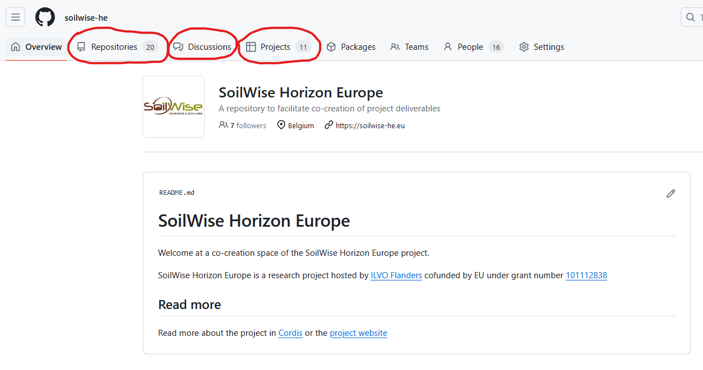

Issues are found and grouped within a specific repository, they can be selected from the "issue" icon in the top bar of a repository:
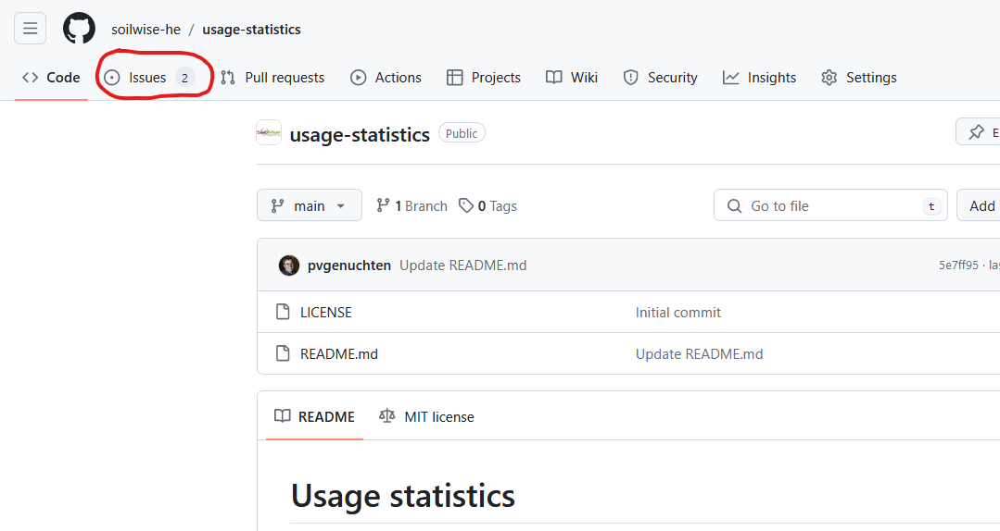  
***
  

 
 

## 2.1. Creating a new repository
https://docs.github.com/en/repositories/creating-and-managing-repositories/creating-a-new-repository

A new repository can be created by: 
- first selecting the "Repositories" icon in the top bar
- then selecting the green button "New repository" in upper right corner

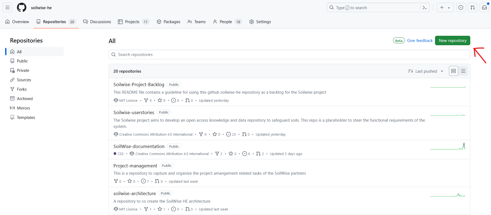

- in the next panel:
  - add a name for the repository related to the technical(sub)component being developed
  - provide a description
  - select public status
  - check box "add a README file"
  - select a license 'e.g. MIT License"'

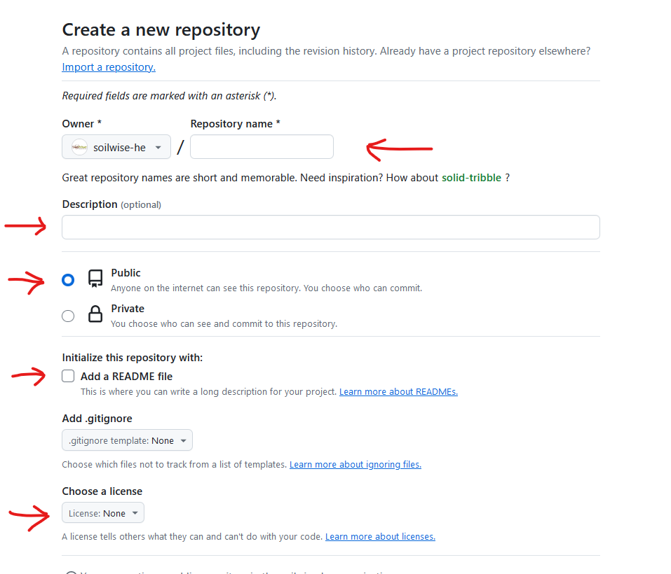
***
 
 
 

## 2.2. Identifying technical components and GA project-tasks related to a repository
Start the README.md document by providing labels for the technical component and tasks related to this document, e.g. INTERLINKER - T2.3 & 3.3. 
A list of the technical components can be found at the end of this document in section "10. Components, leads + collaborations".
 
 
(_an other option could be adding GA project-tasks in the repository name?, immediately visible in the soilwise-he repository_).
 
 
In addition, in the same README.md document provide information about the technical (sub)component being developed in this repository, e.g. scope, functionality, ...
***
 
 
 

## 3. Creating a new issue (representing a task or requirement)
https://docs.github.com/en/issues/tracking-your-work-with-issues/creating-an-issue

**Keep tasks/issues small**: 
_"High granularity helps to see and feel the progress, not only by the developer but also by the product owner. Smaller tasks are also easier to comprehend, and estimate and result in smaller chunks of code that cover task requirements. Resultant code in turn is often easier to test, refactor, review and integrate."_ 
 
 
A new issue for a specific repository can be created by: 
- selecting the "Issues" icon in the upper bar of the specific repository

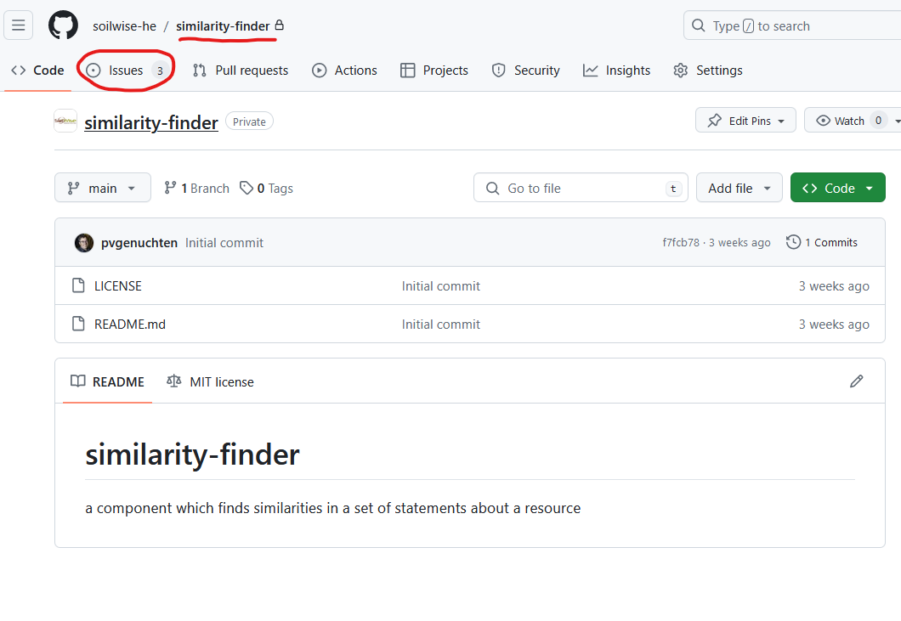

-  selecting the green button "New issue" in upper right corner

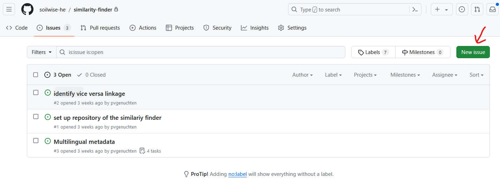

- in the next panel:
  - add a title
  - add a clear and concise description for the task that has to be handled/developed, consider adding specific aspects about the problem, scope, objective, dependencies, resources
  - > It is important to also add one or more acceptance criteria or a definition of done for each task in the description
  - if wanted, on the right select an assignees, add labels ([configure labels for repository](https://docs.github.com/en/issues/using-labels-and-milestones-to-track-work/managing-labels)) or group in a certain project (project already has to exist) for monitoring and planning the task in the development team
  - when ready select "submit new issue" button in lower right-hand corner

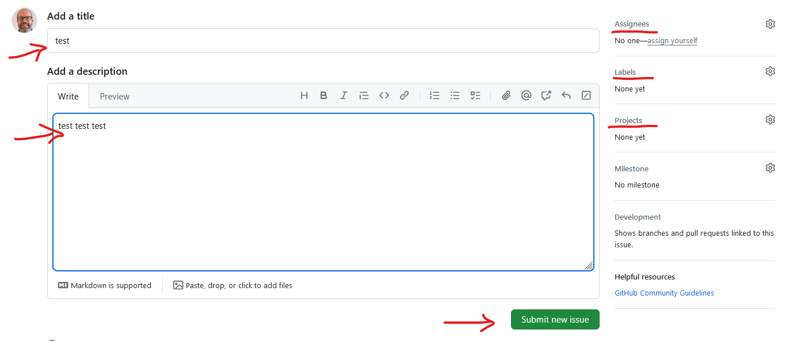
***
 
 
 

## 4. Creating a new discussion

https://docs.github.com/en/discussions/quickstart

TBD
(further documentation when we start using it)

There are multiple categories that can be started as discussion:
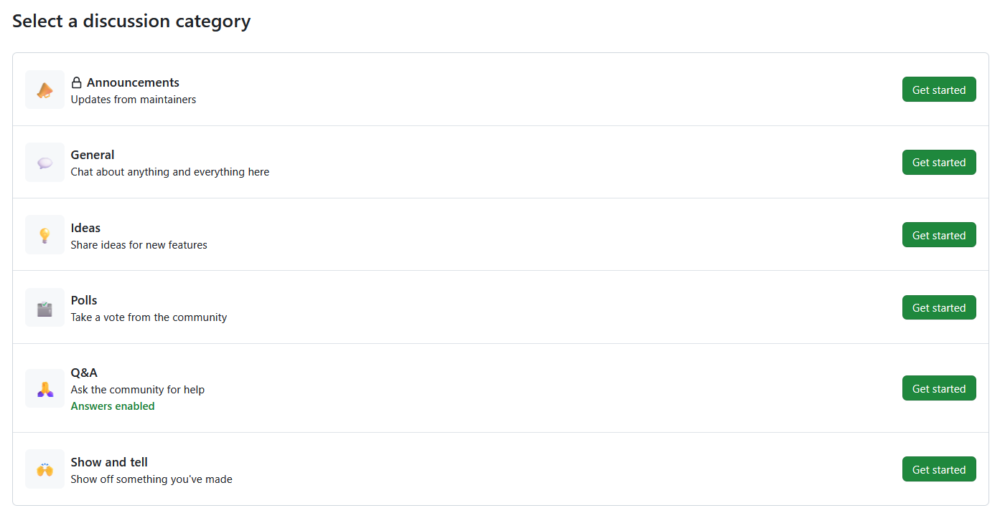

Select for instance "Ideas" and provide a title and content to the discussion you want to start with the community.
When ready, select the green button "Start discussion" in the lower right corner.
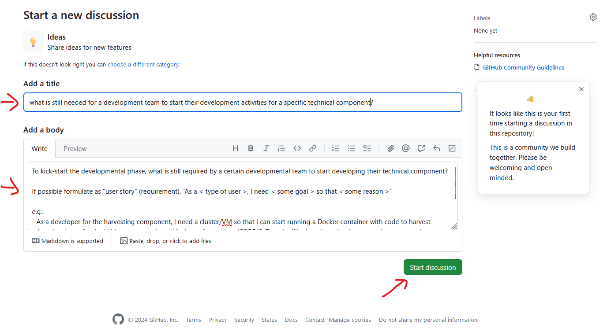

***
 
 
 

## 5 Creating a new project

https://docs.github.com/en/issues/planning-and-tracking-with-projects/creating-projects/creating-a-project

A new project can be created by: 
- first selecting the "Projects" icon in the top bar
- then selecting the green button "New project" in upper right corner

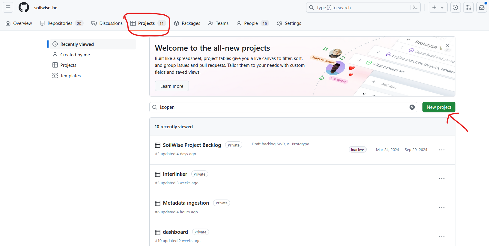

You can then start from a template, select "Featured" and e.g. Kanban.
Or you can start from scratch.

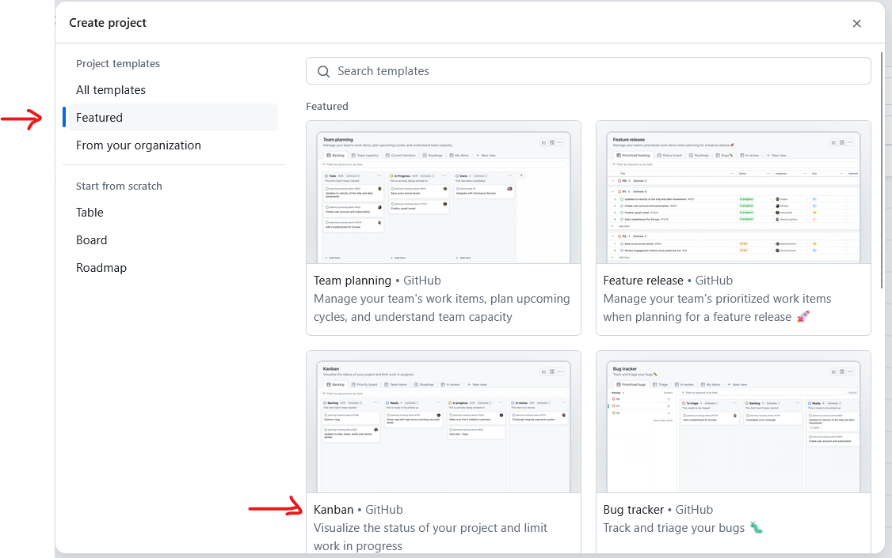

Provide a descriptive name to the project and hit the green button "Create project" in the bottom right corner.

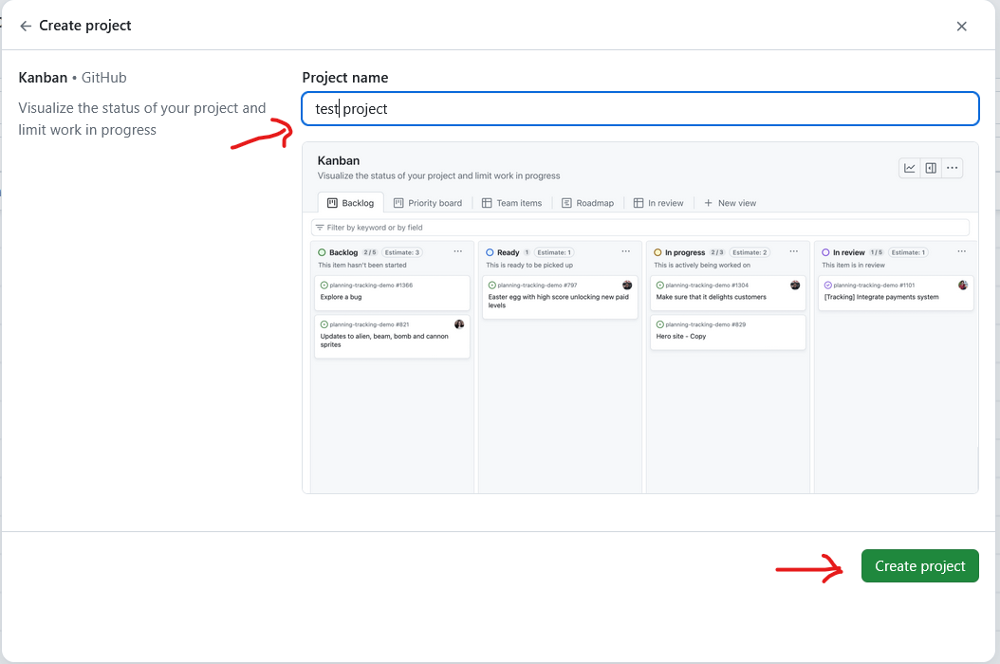

The project can then be further configured via selecting settings in the upper left "..." icon.

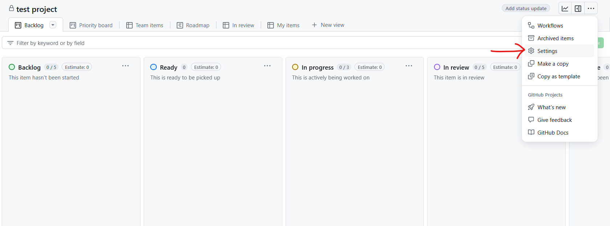

A description can be provided as wel as certain labels ([how to manage labels](https://docs.github.com/en/issues/using-labels-and-milestones-to-track-work/managing-labels)) to follow up in monitoring, e.g. tasks can be filterd in the kanban board via added labels
Possible custom fields to include in describing issues in the project are
- Status
- Size estimation
- WP

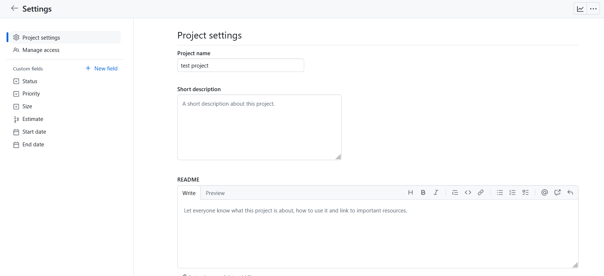

> Do not use a priority label, the Component or WP leads will rank the tasks/issues from the highest priority to the lowest priority, the ranking of the tasks/issues represent the priority ranking.
***
 
 
 

## 6. Pushing an issue to the 'Soilwise Project Backlog' and further describing the issue
It is important that all **"larger"** issues/tasks (**more than 3-days development work**) are pushed to the 'Soilwise Project Backlog'.
This is done by:
- selecting the issue in the repository, 
- in the right border select the 'Projects' bar
- select the "Soilwise Project Backlog"

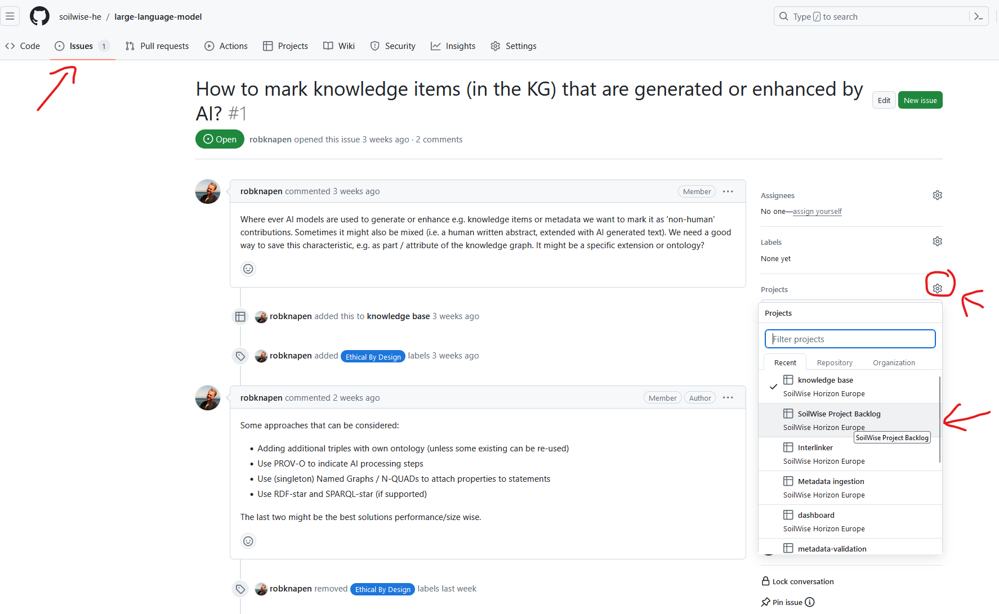

The "Soilwise Project Backlog" can now also be found in the list of projects

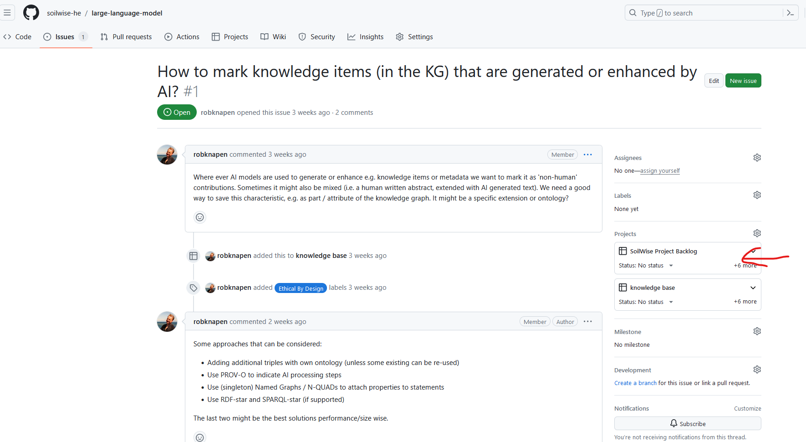

A last step consists of adding information to the issue in the "Soilwise Project Backlog":
- go to the "Soilwise Project Backlog" via the "Projects" icon in the upper bar
- select the "Soilwise Project Backlog"
- select the specific issue
- a window will appear with information logged to the issue
- in the right panel under "Projects" add information relates to 
  - Status (Todo, In Progress, QA or Done, this can also be done by moving the issue to a certain column in the Kanban board)
  - WP (WP2, WP3 or WP4)
  - interaction (interaction needed (= interaction is needed with another team/component), no interaction)
  - Startdate
  - Enddate

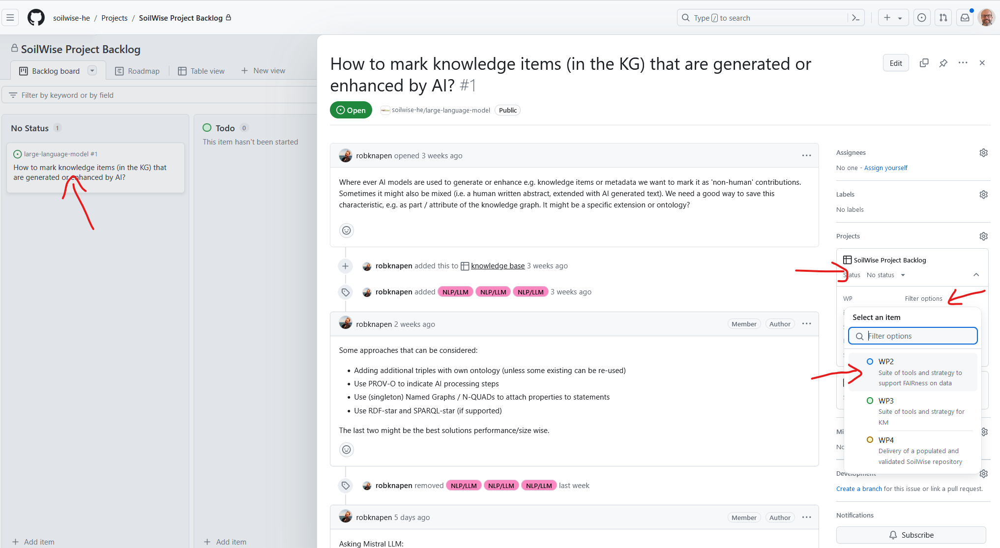

> There is **no inheritance for issues over multiple projects**, this implies status and additional information about an issue/task must also be updated in the "Soilwise Project Backlog" project!!

***
 
 
 

## 7. Sprint refinement meetings
This is a weekly scrum of scrums with component leads and WP leads held on thursday afternoon. 
A cross-component issue having to be discussed during this weekly sprint refinement meeting has to be pushed to the " Soilwise Sprint refinement" project. 
This can be done in a similar way as described in "6. Pushing issue to 'Soilwise Project Backlog' and further describing issue". 
After pushing the issue/task to the "Soilwise Sprint Refinement" go to the project and move the issue to the "To Discuss" column in the Kanban board.

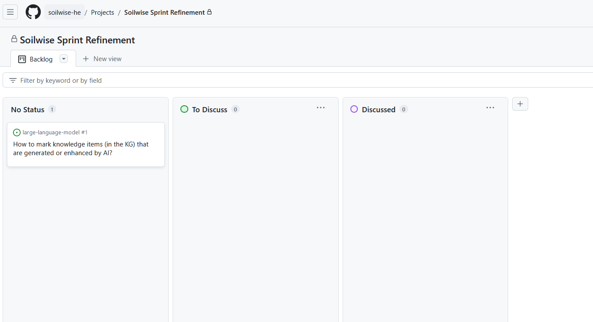

-
***
 
 
 

## 8. Sprint planning
TBD - we are still experimenting in finding a workable approach.  

Currnet approach:

First stage:
  - “major” sprint planning with WP & TC leads -> define high-level/larger requirements (issues) to be dealt with in coming month
  - list issues in Soilwise-Project-Backlog 
  - deadline first sprint planning: 26/04
 
 

Second stage:
  - “micro” sprint planning per development team/technical component
  - refine issues in Soilwise-Project-Backlog to smaller/specific tasks the developers will work on in coming month
  - list issues in projects for specific technical component
  - push "major" issues to Soilwise-Project-Backlog

***
 
 
 

## 9. Sprint retrospective
TBD

***
 
 
 

## 10. Components, leads + collaborations
[architectural design with components (D1.3)](https://ilvo.sharepoint.com/:w:/r/sites/HESoilWiseProject/Gedeelde%20documenten/General/Deliverables/WP1-ISRIC/Deliverable%201.3%20Repository%20Architecture/Deliverable%20D1.3%20Repository%20architecture.docx?d=w79c5891907de4ab9bb02c89c4e142560&csf=1&web=1&e=bfKc2i)

**Metadata authoring**
- lead: WE
- contributors: Paul, MU
- repository: none currently

 

**Data export, download**
- lead: WE
- contributors: Paul, MU, CREA
- repository: [data-download](https://github.com/soilwise-he/data-download)

 

**Hale Studio**
- lead: WE
- contributors: Paul, MU, CREA
- repository: none currently

 

**Usage system & Monitoring**
- lead: WE
- contributors: Paul
- repository:[usage-statistics](https://github.com/soilwise-he/usage-statistics)

 

**Harvester**
- lead: Paul, Cenk
- contributors: Rob & team, Nick
- repository:[harvesters](https://github.com/soilwise-he/harvesters)

 

**Metadata Validation**
- lead: MU (first iteration) - MU/Anna + PhD (second iteration)
- contributors: Paul, Thorsten, Cenk, Hugo, WE
- repository:[metadata-validator](https://github.com/soilwise-he/metadata-validator)

 

**PyCSW**
- lead: Paul
- contributors: MU, Nick
- repository: [pycsw](https://github.com/soilwise-he/pycsw)

 

**Map Server**
- lead: Paul
- contributors: MU
- repository: none currently

 

**Interlinker**
- lead: Rob & team, Anna
- contributors: Nick
- repository: [link-liveliness-assessment](https://github.com/soilwise-he/link-liveliness-assessment), [similarity-finder](https://github.com/soilwise-he/similarity-finder)

 

**GIT**
- lead:
- contributors:
- repository: none currently

 

**PostgreSQL**
- lead:
- contributors:
- repository: none currently

 

**Triple Store**
- lead: Rob & team, Anna
- contributors: Nick
- repository: [triplestore-virtuoso](https://github.com/soilwise-he/triplestore-virtuoso), [soilwise-ontology](https://github.com/soilwise-he/soilwise-ontology)

 

**Large-language-model**
- lead: Rob & team
- contributors: Nick
- repository: [natural-language-querying](https://github.com/soilwise-he/natural-language-querying)

 

technical repositories not directly linked to a technical component:  [dashboard](https://github.com/soilwise-he/dashboard), 
[development-environment-and-infrastructure](https://github.com/soilwise-he/development-environment-and-infrastructure), 
[governance](https://github.com/soilwise-he/governance)

 

other repositories in the github environment linked to the project: 
[SoilWise-documentation](https://github.com/soilwise-he/SoilWise-documentation), [soilwise-architecture](https://github.com/soilwise-he/soilwise-architecture), 
[Soilwise-Project-Backlog](https://github.com/soilwise-he/Soilwise-Project-Backlog), [Soilwise-userstories](https://github.com/soilwise-he/Soilwise-userstories), 
[Project-management](https://github.com/soilwise-he/Project-management)

 

other repositories in the github environment as inspiration: 
[soilinfohub](https://github.com/soilwise-he/soilinfohub), 
[demo-zenodo-neo4j-llm-ilvo](https://github.com/soilwise-he/demo-zenodo-neo4j-llm-ilvo), 
[inspire_soil_gpkg_template](https://github.com/soilwise-he/inspire_soil_gpkg_template)

